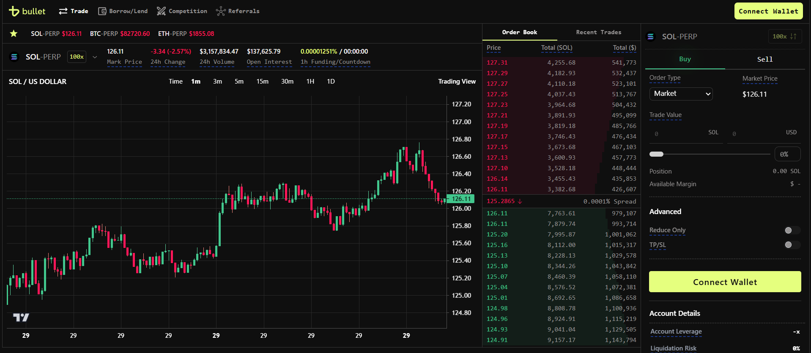
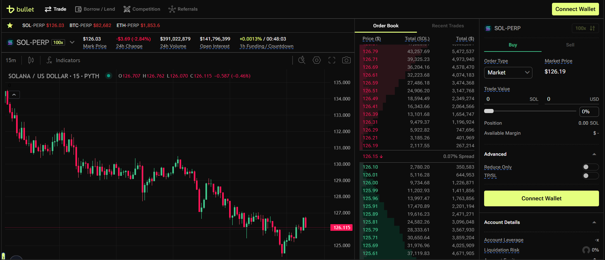
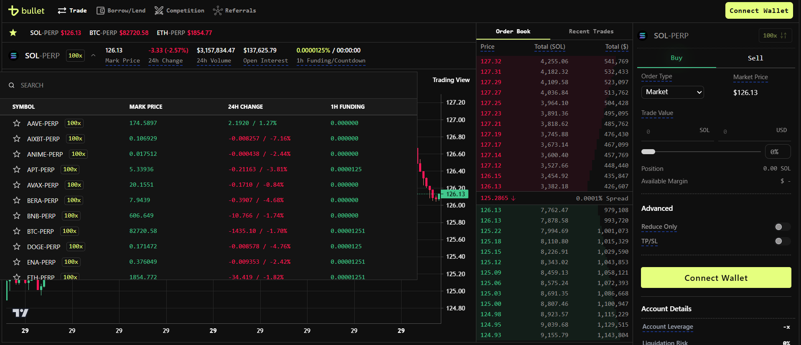
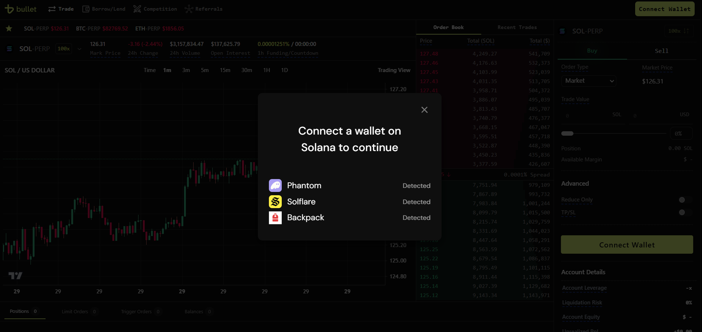

# Bullet Exchange

Bullet is a next-generation blockchain that aims to redefine the user experience of decentralized applications and on-chain trading.
Bullet leverages the state of the art when it comes to blockchain design and zero-knowledge cryptography to enable highly performant yet verifiable applications.

This repository is a frontend clone of the [Bullet Exchange](https://app.bullet.xyz/) platform, designed to replicate its user interface and functionality. The backend is a proxy to another Exchange backend, while the websocket communication is handled via WebSocket API. This

For further details, refer to the [Bullet API documentation](https://docs.bullet.xyz/).

> **Note:** This project is for frontend design and learning purposes only. It makes read-only API calls to the Exchange backend, and no actual trading occurs here. The Bullet Exchange platforms holds the copyright to all associated assets and functionality.

## User Interface

### Cloned Bullet Design



### Actual Bullet Design

Note: Some differences may exist due to the use of paid TradingView charts in the original design.



## API

Upon initial load, the following API calls are made:

1. `/ticker/latest` - Retrieves all tickers.
2. `/klines?symbol=ETH-PERP&interval=1m&startTime=1741786231596&endTime=1742391031596&limit=331` - Fetches the chart candlestick data for the specified ticker.
3. `/trades?symbol=ETH-PERP` - Retrieves recent trades for the ticker.

Subsequent real-time updates are fetched via WebSocket:

- `{"method":"SUBSCRIBE","params":["tickers"],"id":1742391031596}` - Subscribe to updated ticker data.
- `{"method":"SUBSCRIBE","params":["ETH-PERP@kline_1m"],"id":1742391031597}` - Subscribe to real-time candlestick data.
- `{"method":"SUBSCRIBE","params":["ETH-PERP@depth"],"id":1742391031598}` - Subscribe to current bids/asks in the order book.
- `{"method":"SUBSCRIBE","params":["ETH-PERP@trades"],"id":1742391031598}` - Subscribe to real-time trades data.

The WebSocket responses are Brotli compressed, and the data is decompressed before being updated in real time.

## Architecture

1. The frontend replicates the Bullet Exchange UI design.
2. The candlestick chart is rendered for markets, utilizing both REST and WebSocket APIs to fetch and stream candlestick data in real time.

3. **Other Features:**

   - A dropdown menu allows users to select different markets.

     

   - Integration with the Solana wallet adapter for the `Connect Wallet` feature.
     

   - Time interval switching for the candlestick chart.

## Technical Specifications

- Built using **React**, **Node.js**, and **TypeScript**.
- **TradingView's [`lightweight-charts`](https://github.com/tradingview/lightweight-charts)** library is used to render the candlestick chart.
- Backend deployed on an EC2 instance. Frontend via S3 + Cloudfront.

## Setup and Installation

### Backend

```bash
cd backend
npm install
npm run dev
```

#### Frontend

Update `PROXY_SERVER_URL` in `frontend/src/utils/constants.ts` to `http://localhost:7000`

```
cd frontend
npm install
npm run dev
```

Go to <a>http://localhost:5173</a>
